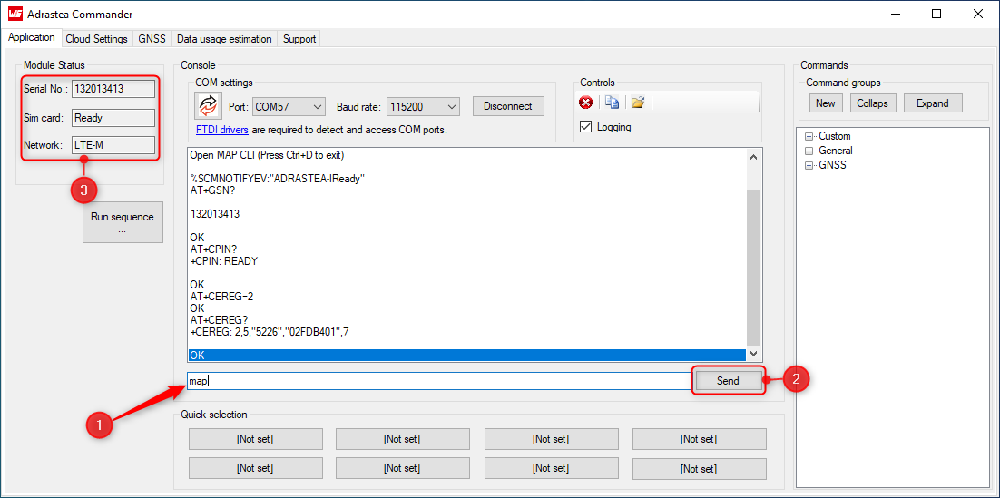

#  How to create an demo IoT application using the Adrastea-I FeatherWing kit?

This guide will take you through the process of unboxing the Adrastea-I FeatherWing kit, configuring it and finally sending sensor data to the IoT platform of your choice.
This is a quick start guide intended to get the kit operational in quick time. 

> [!NOTE]  
> **For Advanced users:**
> 
>A [separate repository](https://github.com/WurthElektronik/adrastea-SDK) which contains the source code and step by step instructions to develop firmware on the Adrastea-I platform can be found under, 
> https://github.com/WurthElektronik/Adrastea-SDK.   

## **Prerequisites**
In order to go through this process you will need the following.

### **Hardware**
1. The [**Adrastea-I FeatherWing kit**](https://www.we-online.com/en/components/products/ADRASTEA-I_FEATHERWING_KIT). Contact [**wcs@we-online.com**](mailto:wcs@we-online.com) or your local sales contact to get your kit.

2. A windows computer with internet access.

3. A valid NB-IoT or LTE-M enabled nano SIM card.


### **Software**

1. Install [**drivers**](https://ftdichip.com/drivers/vcp-drivers/) for the UART-to-USB chip on the Adrastea-I FeatherWing.

3. The [**Adrastea commander tool**](https://www.we-online.com/components/products/media/724786).

> [!WARNING] 
> This tool works only on Windows platform. This tool may require installation or update of dotnet runtime. If this is not already installed, please [download](https://dotnet.microsoft.com/en-us/download/dotnet/thank-you/runtime-6.0.36-windows-x64-installer) and install this package.

4. (Optional) If you intend to follow the examples and use AWS IoT core, Azure IoT hub or KaaIoT, you will need to have the corresponding accounts and credentials.

## **Unboxing the Adrastea-I FeatherWing Kit**

The Adrastea-I FeatherWing Kit consists of the following parts:

1. 1x Adrastea-I FeatherWing
2. 1x Sensor FeatherWing
3. 1x Cellular antenna
4. 1x GNSS antenna
5. 2x u.FL to SMA connectors
6. 1x USB A to micro-USB cable

### **Adrastea-I FeatherWing**

The Würth Elektronik eiSos [Adrastea-I FeatherWing](https://www.we-online.com/en/components/products/ADRASTEA-I) is a development board for the Adrastea-I radio module. [Adrastea-I](https://www.we-online.com/en/components/products/ADRASTEA-I) (2615011136000) module is a compact LTE-M/NB-IoT cellular module with integrated GNSS, integrated ARM Cortex-M4 and 1MB flash memory for customer developed applications. It is fully compatible to the popular Adafruit Feather line of development boards and extends the feathers with Cellular IoT connectivity.


Adrastea-I module is a compact LTE-M/NB-IoT cellular module with integrated GNSS and integrated ARM Cortex-M4 with 1MB flash memory for simple custom applications, similar to such use-cases and applications this guide will showcase in the following chapters.
Based on the Sony Altair ALT1250 chipset, the Adrastea-I module provides AT-Command based multi-band configurability, enabling international multi-regional coverage in LTE Cat M1/NB1 radio access technologies.
Adrastea-I includes a fully integrated global navigation satellite system solution that supports GPS and GLONASS positioning systems.

Compact 13.4 mm x 14.6 mm x 1.85 mm design allows the module to fit in small-size applications.
The module can be operated through one of two available cellular communication technologies:
* LTE-Cat.M or
* LTE-Cat.NB-IoT.

The module comes with the declaration of conformity (CE) and is compliant to RoHS, REACh. The Adrastea-I cellular radio module is GCF and Deutsche Telekom certified.

Further details about the Adrastea-I radio module can be found under [we-online.de/katalog/en/Adrastea-I](https://www.we-online.com/en/components/products/ADRASTEA-I).


### **Sensor FeatherWing**

The Würth Elektronik eiSos [Sensor FeatherWing](https://www.we-online.de/katalog/en/SENSOR_FeatherWing) is a sensor development board fully compatible to the popular [Adafruit](https://www.adafruit.com/) [Feather line](https://www.adafruit.com/feather) of development boards. It integrates the following four sensors:

* [**WSEN-PADS**](https://www.we-online.de/katalog/de/WSEN-PADS) - Absolute pressure sensor [(2511020213301)](https://www.we-online.de/katalog/datasheet/2511020213301.pdf)
* [**WSEN-ITDS**](https://www.we-online.de/katalog/de/WSEN-ITDS) - 3-axis acceleration sensor [(2533020201601)](https://www.we-online.de/katalog/datasheet/2533020201601_valid_from_2020-12-14.pdf)
* [**WSEN-TIDS**](https://www.we-online.de/katalog/de/WSEN-TIDS) - Temperature sensor [(2521020222501)](https://www.we-online.de/katalog/datasheet/2521020222501.pdf)
* [**WSEN-HIDS**](https://www.we-online.de/katalog/de/WSEN-HIDS) - Humidity sensor [(2525020210002)](https://www.we-online.de/katalog/datasheet/2525020210002.pdf)

All four sensors are connected over the shared I<sup>2</sup>C bus and hence can be connected to any of the Feather microcontroller boards. The available C/C++ drivers and examples make it easy to build a prototype to kick-start the application development.

The Sensor FeatherWing also has a [4-pin JST QWIIC®](https://www.sparkfun.com/products/16766) connector on-board. This enables easy connection to SparkFun's [QWIIC® ecosystem](https://www.sparkfun.com/qwiic) of development boards. Additionally, a **6 pin connector** enables the extension of the FeatherWing with a host of [**evaluation boards from Würth Elektronik eiSos**](https://www.we-online.de/catalog/de/wco/wireless-connectivity_1/eval_boards).


### **Step 1**: Insert an active nano SIM that supports NB-IoT or LTE-M.


### **Step 2**: Stack the Sensor FeatherWing on top of the Adrastea-I FeatherWing.


### **Step 3**: Connect the antennas to the Adrastea-I FeatherWing using the coaxial adapter pigtails.


### **Step 4**: Finally, power-on the FeatherWing stack by connecting it to your PC using the USB cable provided in the box. Do not power on the board without the antennas being connected.


## **Quick start guide**
In order to configure the Adrastea-I FeatherWing kit, you will need the [**Adrastea commander tool**](https://www.we-online.com/components/products/media/724786). Make sure to download and extract the contents and check your system has the dotnet runtime installed.

Open the Adrastea Commander by double clicking on the "AdrasteaCommander.exe".


When connected to the PC, the UART ports of the Adrastea-I FeatherWing appear as virtual COM ports. The table below show the function of each of the COM ports. 

:warning: The order and numbering of COM ports may be different on different PCs, however the function of the COM ports as per the following table will typically be reflected in their ascending numbering.

| COM port| Function|
|-------|--------|
|COM0 |Miniconsole (AT command). Only UTX and URX|
|COM1|Console Logs. Only UTX and URX|
|COM2|Firmware update. Full UART (inc. /CTS and /RTS)|
|COM3|Not used|


### **Step 1**: Connect to AT command COM port 
Click on Refresh button to update the COM port list and pick the first port (e.g. COM0 as per this example) from the drop down list and then click on the "Connect" button.


### **Step 2**: Initial configuration
The Adrastea-I FeatherWing comes pre-flashed with the standard firmware which provides an AT command interface on the COM0. In order to enable this interface, send the following command,

```
map
```

Following this command, the module is switched into AT command mode. The tool sends a couple of AT commands automatically to check the connectivity status. Once connected to the network, the module status is updated with the current status. Make sure that the SIM card status is "Ready"




It is mandatory to send the following AT command before going to the next step. This will set the bootloader delay to 10 seconds which is essential for further steps.

```
AT%SETBDELAY=10
````

### **Step 3**: Flash the cloud connectivity firmware

> [!WARNING] 
> After flashing the cloud connectivity firmware, you will lose the standard AT command functionality of the Adrastea-I FeatherWing. It is however possible to re-flash the standard firmware. Please contact [**wcs@we-online.com**](mailto:wcs@we-online.com) or your local sales contact to get the standard firmware.

In order to enable sending sensor data to the cloud, the Adrastea-I FeatherWing needs to be flashed with a different firmware. In order to do this, perform the following steps.

1. In the "Cloud Settings" tab of the Adrastea commander, select the FW update COM port (COM2, as per this example) from the "COM Ports" drop down.
2. In the "Firmware" section, click on "Select" button to open the windows file explorer. In the file explorer, browse to the root folder of the Adrastea Commander and select the binary file "adrastea_sensor_app_vX_X_X.bin". The suffix "_vX_X_X" represents the firmware version. For example, "adrastea_sensor_app_v1_0_0.bin".

3. Finally, press the hardware reset button on the FeatherWing and the click on the "Flash Firmware".

Wait for the flashing process to complete. A progress bar shows the progress and status message will appear when the firmware has been successfully flashed.


> [!WARNING] 
> Ensure that no other application is using or trying to access the COM port while flashing. Do not disconnect or reset the device during the flashing process from USB. Do not move the FeatherWing stack while this update is ongoing.


### **Step 4**: Configure and connect to IoT platform
In this step, we will configure the IoT platform as well as the Adrastea-I FeatherWing kit with all the necessary parameters. After this, the module automatically connects to the IoT platform and starts sending sensor data periodically to the IoT platform.

Follow the instructions in the links below to connect your kit to the platform of your choice.

- [**Eclipse Mosquitto broker**](mosquitto.md)
- [**AWS IoT core**](aws.md)
- [**Azure IoT hub**](azure.md)
- [**KaaIoT**](kaa.md)
