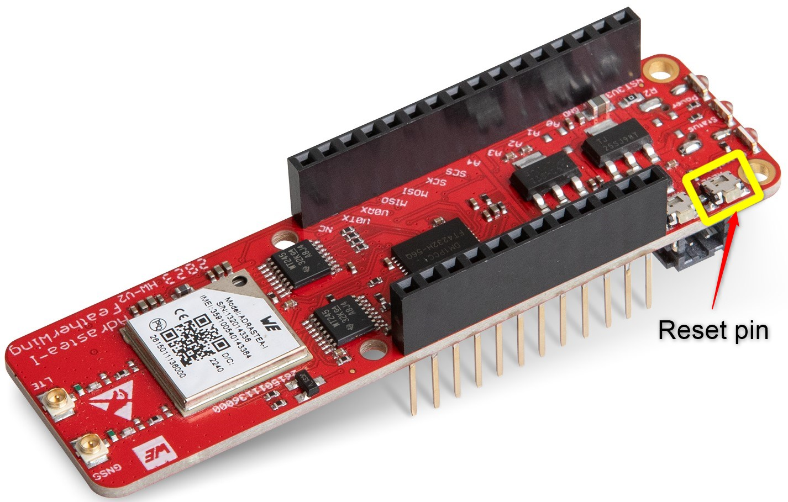

# Quick start guide using AWS IoT Core

AWS IoT provides the cloud services that connect your IoT devices to other devices and AWS cloud services. If your devices can connect to AWS IoT, AWS IoT can connect them to the cloud services that AWS provides.

The AWS IoT Core message broker supports devices and clients that use MQTT and MQTT over WSS protocols to publish and subscribe to messages.

This document will guide you through the process of configuring the AWS IoT core as well as the Adrastea-I FeatherWing kit and sending sensor data from the kit to AWS.

# AWS IoT Configuration Guide

This guide outlines the necessary steps to create and configure AWS IoT core. Before proceeding, please familiarize yourself with the AWS IoT Core service by visiting the official documentation: [AWS IoT Core](https://aws.amazon.com/iot-core/).

> [!WARNING]  
> Please ensure that you do not share your private keys and certificates with anyone.


## Setup Steps
To configure your IoT core, follow these key steps:

1. **Create an AWS Account**  
2. **Create device**  
3. **Generate and download device certificates**   

>[!WARNING]
> AWS services and interfaces are continuously updated. Refer to [AWS IoT](https://aws.amazon.com/iot/) documentation for the latest details.

## Step 1: Create an AWS Account
To access AWS IoT services, create an AWS account and configure permissions. Follow the official guide for step-by-step instructions:

- [Create and Activate an AWS Account](https://aws.amazon.com/premiumsupport/knowledge-center/create-and-activate-aws-account/)
- [Setting Up AWS IoT](https://docs.aws.amazon.com/iot/latest/developerguide/setting-up.html)


## Step 2: Create device
1. Log in to the AWS Management Console.
2. Navigate to **IoT Core** using the search bar.


3. Under **Manage** -> **All Devices**, select **Things**.


4. Choose **Create things** and click **Next** and select **Create single thing** with policy


and attach the policy below. This AWS IoT policy grants full access to IoT Core operations, including connecting, publishing, receiving, and subscribing to topics. The policy applies to all IoT resources within the AWS account.


**Policy Summary**

This AWS Identity and Access Management (IAM) policy allows the following actions for all IoT resources (`*`):

- **iot:Connect**: Allows the device to connect to the AWS IoT Core service.
- **iot:Publish**: Allows the device to publish messages to AWS IoT topics.
- **iot:Receive**: Allows the device to receive messages from AWS IoT topics.
- **iot:Subscribe**: Allows the device to subscribe to AWS IoT topics.


**Policy JSON**

```json
{
  "Version": "2012-10-17",
  "Statement": [
    {
      "Effect": "Allow",
      "Action": "iot:Connect",
      "Resource": "*"
    },
    {
      "Effect": "Allow",
      "Action": "iot:Publish",
      "Resource": "*"
    },
    {
      "Effect": "Allow",
      "Action": "iot:Receive",
      "Resource": "*"
    },
    {
      "Effect": "Allow",
      "Action": "iot:Subscribe",
      "Resource": "*"
    }
  ]
}
```


5. Provide a unique name for your device (e.g., `adrastea-iot-kit-1`).


6. Keep **Device Shadow** set to default (`No shadow`) and proceed.


## Step 3: Generate and download device certificates
1. Select **Auto-generate a new certificate (recommended)** and click **Next**.


2. Download and securely store the generated certificate, public key, and private key.


> [!WARNING] 
> Please ensure that you do not share your private keys and certificates with anyone. The private key can be downloaded just once.


# Configure Adrastea-I FeatherWing kit and run the application

In the previous step, we configured AWS IoT core. Here, we will configure the Adrastea-I FeatherWing kit to connect to AWS.

## Create configuration file

The firmware on the Adrastea-I FeatherWing implements an MQTT client which can be configured by uploading a configuration file on to the flash memory.
The following steps will guide you through the process of creating and uploading the configuration file.

**Step 1:** In the "Cloud Settings" tab of the Adrastea Commander, click on the drop down "Cloud Type" in the "Cloud Configuration" section.
Select "AWS" option. This will give you a configuration template in the "Config JSON" text box.

!aws_select](resources/select_AWS.png)


**Step 2:** Now modify the JSON configuration file by updating the following fields.
- Client ID - The client ID should be the unique name of the "Thing" that was defined when creating the "Thing" on AWS IoT core. See [here.](#step-2-create-device).
- End point URL

> ✅The end point URL is the domain name which you can find in your AWS IoT core under Connect > Domain Configurations

- Topics to subscribe
- Topic to publish

Here is an example,

```json
{
    "version":"1.0",
    "cloud_type":"AWS",
    "client_id":"adrastea-iot-kit-1",
    "endpoint_url":"a2b4cdef3hij-xyz.iot.region-country-1.amazonaws.com",
    "subscribe_topics":[
        "adrastea/+"
    ],
    "publish_topic":"adrastea/telemetry",
    "keep_alive_time":"1200",
    "Qos":"1"
 }
```
You can optionally save this configuration file by clicking on the "SaveAs JSON" button. Use the "Load Config JSON" button to reload previously saved files.

## Flash certificates, key and Configuration file
In the previous steps, we have created configuration JSON, client certificate, key and downloaded the root CA certificate. In this step we will flash these certificates on to the Adrastea-I FeatherWing.

In order to do this,

1. In the "Cloud Settings" tab of the Adrastea commander, select the last but one COM port (function: firmware update, COM2 as per example) from the "COM Ports" drop down.

2. Click of each of the following buttons to open the file explorer and each case select the corresponding file.

- "Add Certificate" -> client certificate
- "Add Private Key" -> client key
- "Add Root CA" -> root CA certificate

3. Press the hardware reset button on the FeatherWing and the click on the "Flash Config".

Wait for the flashing process to complete. A progress bar shows the progress and status message will appear when the configuration file has been successfully flashed.

> [!WARNING] 
> Ensure that no other application is using the same COM port while flashing. Do not disconnect or reset the device during the flashing process. Do not move the device while the update is ongoing.





## Run the application

Now that the Adrastea-I FeatherWing kit is configured, press the reset button to start the application.


The application now reads all the sensor values, creates a JSON payload and publishes the same on to the pre-configured topic once every minute.


# View sensor data on AWS test client

1. Open the **MQTT Test Client** under **Test**.
2. Subscribe to the same topic you configured in the Kit configuration [step.](#create-configuration-file)
3. Check data from MQTT test client.


# Storing MQTT Data in DynamoDB via Lambda function

> [!WARNING] 
> The services used in the guide below may not be free of cost. Please be aware that using these services from AWS can result in additional costs. 

 
If you wish to store your data on AWS DynamoDB, you must first create the tables in DynamoDB where you want to store the incoming data via MQTT. Then, you need to configure a Message routing rules to route the incoming data to these tables.
 
 
[How-To-Store- MQTT Data in DynamoDB via Lambda and AWS IoT Core](aws_iot_core_dynamodb.md)