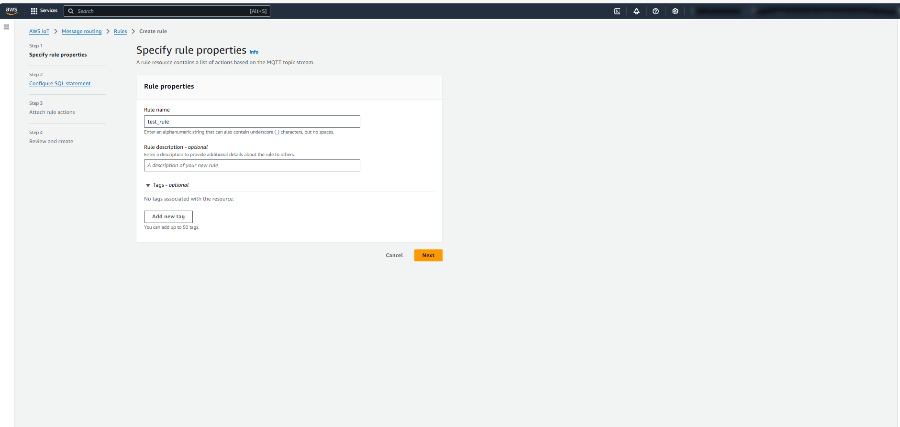

# Storing MQTT Data in DynamoDB via Lambda and AWS IoT Core

## Table of Contents

- [Storing MQTT Data in DynamoDB via Lambda and AWS IoT Core](#storing-mqtt-data-in-dynamodb-via-lambda-and-aws-iot-core)
  - [Table of Contents](#table-of-contents)
  - [Overview](#overview)
  - [Prerequisites](#prerequisites)
  - [Step 1: Set Up DynamoDB Table](#step-1-set-up-dynamodb-table)
    - [1.1. Create DynamoDB Table](#11-create-dynamodb-table)
  - [Step 2: Create a Lambda Function](#step-2-create-a-lambda-function)
    - [2.1. Create the Lambda Function](#21-create-the-lambda-function)
    - [2.2. Lambda Function Code](#22-lambda-function-code)
  - [Step 3: Create a Rule](#step-3-create-a-rule)
    - [Navigate to the AWS IoT Console](#navigate-to-the-aws-iot-console)
    - [Configure the SQL Query for the Rule](#configure-the-sql-query-for-the-rule)
    - [Attach Lambda Function](#attach-lambda-function)


## Overview

This guide explains how to configure AWS IoT Core to store incoming MQTT messages in a DynamoDB table using a Lambda function. This will allow you to process, store, and manage IoT data efficiently.

## Prerequisites

- AWS account
- Basic knowledge of AWS services like AWS IoT Core, Lambda, DynamoDB, and IAM roles
- AWS CLI or AWS Console access
- MQTT client to publish messages (e.g., MQTT.fx or a custom IoT device)

## Step 1: Set Up DynamoDB Table

First, create a DynamoDB table that will store the incoming MQTT data.


### 1.1. Create DynamoDB Table

1. Go to the **AWS Management Console** and navigate to **DynamoDB**.
2. Click **Create table**.
3. Enter a **Table name**, for example, `Sensor_Acceleration_Table`.
4. Define the **Primary key**. For example:
   - **Partition key**: `device_id` (String)
   - **Sort key**: `timestamp` (String)  
5. Leave the default settings for provisioned or on-demand capacity (based on your use case).
6. Click **Create**.

## Step 2: Create a Lambda Function

The Lambda function will process incoming MQTT messages and store them in DynamoDB.

### 2.1. Create the Lambda Function

1. Go to the **AWS Management Console** and navigate to **Lambda**.
2. Click **Create function**.
3. Select **Author from scratch**.
4. Name the function, for example, `Sensor_Acceleration_Function`.
5. Select the runtime (e.g., Python 3.x or Node.js).
6. Under **Permissions**, select an existing role or create a new role with basic Lambda permissions and DynamoDB access.

### 2.2. Lambda Function Code

Here’s a basic example of a Python Lambda function to store the MQTT data in DynamoDB:


```python
import json
import boto3
from datetime import datetime
from decimal import Decimal

# Create a DynamoDB client
dynamodb = boto3.resource('dynamodb', region_name='eu-north-1')


# Reference the DynamoDB table
table = dynamodb.Table('Sensor_Acceleration_Table')

def lambda_handler(event, context):
    try:
        # The event parameter contains the JSON data to be saved
        json_data = event
        current_datetime = datetime.now().isoformat()
        
        json_payload = json.dumps(json_data)
        print(json_payload)
        
        new_json = json.loads(json_payload)
        
        new_json["time_stamp"] = current_datetime
        json_payload = json.dumps(new_json, indent=4)
        print(json_payload)
        
        converted_json = json.loads(json_payload, parse_float=Decimal)
        print(converted_json)

        # Save the item to DynamoDB
        table.put_item(Item=converted_json)
        print('Data saved successfully')
        return {
            'statusCode': 200,
            'body': json.dumps('Data saved successfully')
        }
    except Exception as e:
        print(f'Error saving data: {e}')
        return {
            'statusCode': 500,
            'body': json.dumps('Error saving data')
        }
```
## Step 3: Create a Rule 


This guide explains how to create an IoT rule on AWS IoT Core to route MQTT messages to different services or actions, such as Lambda functions, DynamoDB etc.


###  Navigate to the AWS IoT Console
1. Open the **AWS IoT Core Console**:  
   [AWS IoT Core Console](https://console.aws.amazon.com/iot/).
2. In the left-hand menu, under **Message Routing**, click **Rules**.
Click the **Create rule** button.
   

### Configure the SQL Query for the Rule
 In the **SQL statement** field, write the query to select messages from your desired MQTT topic.

   


### Attach Lambda Function

Attaching a Lambda function to an IoT rule in AWS IoT Core allows you to process incoming messages from your IoT devices and take appropriate actions, such as storing the data, performing calculations, or integrating with other AWS services.

When you create an IoT rule, you can specify one or more actions that the rule will trigger when a message matching the SQL query is received. One of the most common actions is invoking a Lambda function.


