# Quick start guide using Azure IoT Hub
Azure IoT Hub is a managed service hosted in the cloud that acts as a central message hub for communication between an IoT application and its attached devices. You can connect millions of devices and their backend solutions reliably and securely.

Several messaging patterns are supported, including device-to-cloud messages, uploading files from devices, and request-reply methods to control your devices from the cloud. IoT Hub also supports monitoring to help you track device creation, device connections, and device failures.

This document will guide you through the process of configuring the Azure IoT hub as well as the Adrastea-I FeatherWing kit and sending sensor data from the kit to cloud.

# Azure IoT Configuration Guide

This guide provides the necessary steps to configure and set up Azure IoT Hub. It covers the process of signing up for Azure, creating necessary resources, and configuring the IoT Hub with secure device communication.

> [!WARNING] 
> Please ensure that you do not share your private keys and certificates with anyone.


## Setup Steps

To configure your IoT hub, follow these key steps:

1. **Create your Azure account**  
2. **Add a subscription and resource group**  
3. **Create an instance of Azure IoT hub** 
4. **Generate device certificates**
5. **Create a device on IoT hub**


>[!WARNING]
> Microsoft Azure services and interfaces are continuously updated. Refer to [Azure IoT](https://learn.microsoft.com/en-us/azure/iot/) documentation for the latest details.


## Step 1: Create your Azure account

To begin, you need an active Azure account.

Visit the [Azure Sign-Up page](https://azure.microsoft.com/en-us/free/) to create a free account if you don't already have one.
Follow the instructions to complete the sign-up process, including providing payment information (you won't be charged for free services during the trial period).

Once your account is created, you'll need to add a subscription.

## Step 2: Add a subscription and resource group

Navigate to the **Azure portal**: [Azure Portal](https://portal.azure.com/)
Go to the **Subscriptions** page and click on **+ Add** to create a new subscription if one is not automatically added.
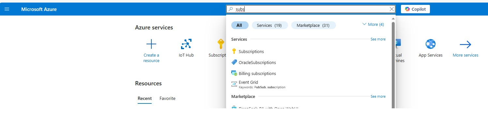
Select your subscription type and follow the on-screen instructions.

Choose a **Subscription** and **Resource Group Name**.
Select the **Region** closest to your devices to optimize latency.
Click on **Review + Create**, and then click **Create** to complete the process.


## Step 3: Create an instance of Azure IoT hub

Now it's time to create the Azure IoT Hub, which will handle the communication between your IoT devices and the cloud.

In the **Azure Portal**, search for **IoT Hub** and select **Create**.

  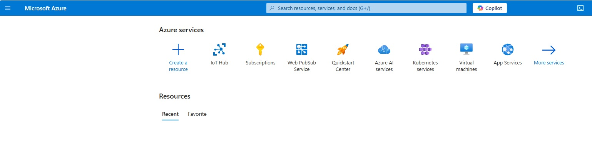
  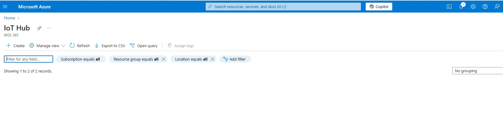

Fill in the required details:
  - **Subscription**: Choose the correct subscription.

    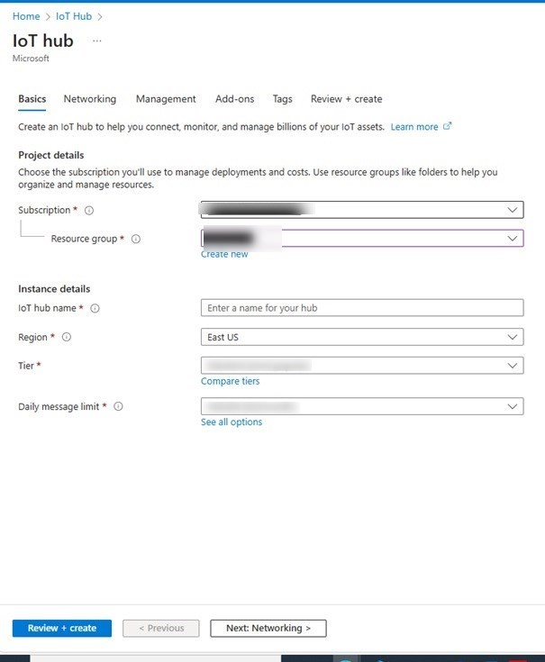

  - **Resource Group**: Select the resource group you created earlier.
  - **Region**: Choose the same region you selected for your resource group.
  - **IoT Hub Name**: Choose a unique name for your IoT Hub.
  - **Pricing and Scale**: Choose the appropriate pricing tier based on your needs. A free tier is good enough for testing.

Click on **Review + Create**, and then click **Create** to finalize the IoT Hub creation.

## Step 4: Generate device certificates

For secure communication between your IoT devices and the Azure IoT Hub, you will need to generate a certificate for your device.

This guide explains how to generate a self-signed X.509 certificate using OpenSSL. Self-signed certificates are useful for testing, local development, and secure communication without requiring a Certificate Authority.


> [!WARNING] 
> We will use OpenSSL to create keys and perform other cryptographic operations. If you do not have OpenSSL installed on your PC you could use an online version of OpenSSL like [cryptotool.org](https://www.cryptool.org/en/cto/openssl/).


**Generate a private key:**

 ```bash
openssl genrsa -out device_key.pem 2048
```
This generates a private key with AES-256 encryption.

**Create a certificate signing request (CSR):**:

```bash
openssl req -new -key device_key.pem -out device.csr
 ```
Follow the prompts to enter details like country, organization, and common name (domain name or IP address).

 - **Generate a self-signed X.509 certificate:**

```bash
openssl X.509 -req -days 365 -in device.csr -signkey device_key.pem -out device_cert.pem
  ```
This creates a certificate valid for 365 days.


You would additionally need the root CA certificate used by Azure IoT hub for secure connection. You can download the root CA certificate [here.](https://cacerts.digicert.com/DigiCertGlobalRootG2.crt)
Make sure that you save the device key and the device certificate as well as the root CA certificate in a single location for future use.


## Step 5: Create a device on IoT hub

In the IoT hub you created earlier, go to Security settings -> Certificates and click on "+ Add" button. Give your certificate a name and upload the device certificate. Make sure that the check box "Set certificate status to verified on upload" is checked

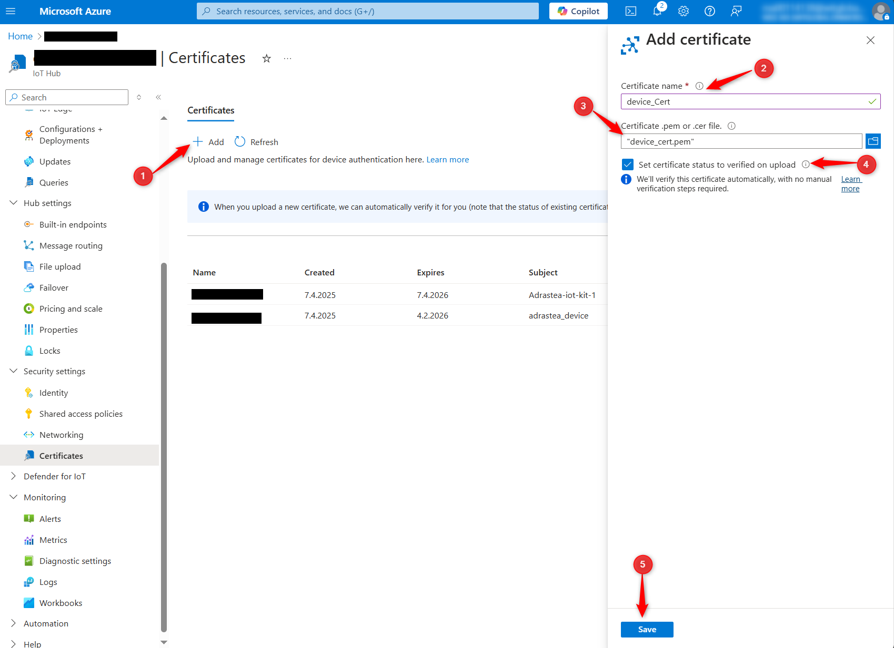

**Copy Thumbprint**

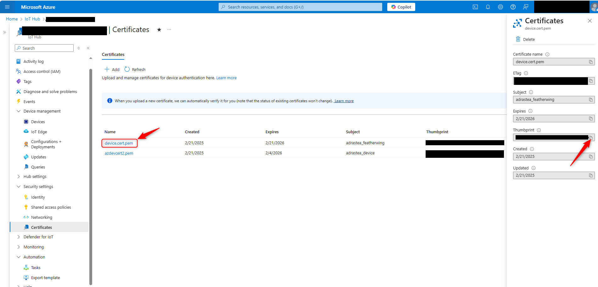

**Add Device**

1. **Enter the device name**  
2. **Select** `X.509 Self-Signed` as the authentication method  
3. **Paste** the thumbprint (previously copied) as both **primary** and **secondary** thumbprint
4. **Click Save** to complete the registration  

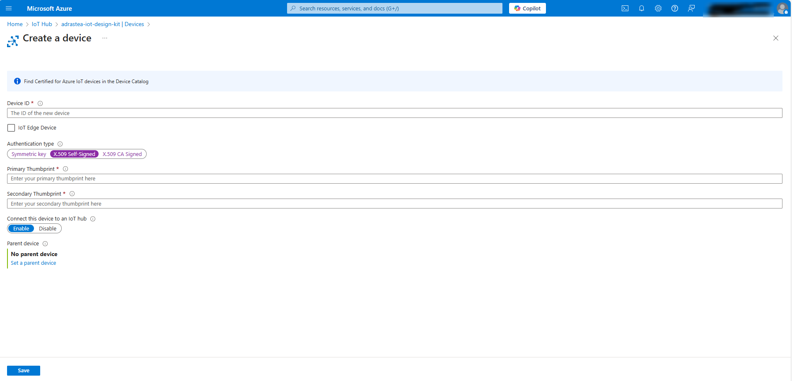


# Configure Adrastea-I FeatherWing kit and run the application

In the previous step, we configured Azure IoT hub. Here, we will configure the Adrastea-I FeatherWing kit to connect to the IoT hub.

## Create configuration file

The firmware on the Adrastea-I FeatherWing implements an MQTT client which can be configured by uploading a configuration file on to the flash memory.
The following steps will guide you through the process of creating and uploading the configuration file.

**Step 1:** In the "Cloud Settings" tab of the Adrastea Commander, click on the drop down "Cloud Type" in the "Cloud Configuration" section.
Select "Azure" option. This will give you a configuration template in the "Config JSON" text box.

[!Azure_select](resources/select_Azure.png)

**Step 2:** Now modify the JSON configuration file by updating the following fields.
- Device ID - The device ID should be the unique name of the "device" that was defined when creating the "device" on Azure IoT Hub. See [here.](#step-5-create-a-device-on-iot-hub).
- IoT hub name - Name of the IoT hub that was defined during its creation in the [previous step.](#step-3-create-an-instance-of-azure-iot-hub) 

Here is an example,

```json
{
    "version": "2.0", 
    "cloud_type":"AZURE", 
    "device_id":"Adrastea-iot-kit-1", 
    "iot_hub_name": "adrastea-test-hub",
    "api_version" : "2021-04-12", 
    "port_number" : "8883",
    "keep_alive_time":"1200", 
    "Qos":"1"  
}
```
You can optionally save this configuration file by clicking on the "SaveAs JSON" button. Use the "Load Config JSON" button to reload previously saved files.

## Flash certificates, key and Configuration file
In the previous steps, we have created configuration JSON, client certificate, key and downloaded the root CA certificate. In this step we will flash these certificates on to the Adrastea-I FeatherWing.

In order to do this,

1. In the "Cloud Settings" tab of the Adrastea commander, select the last but one COM port (function: firmware update, COM2 as per example) from the "COM Ports" drop down.

2. Click of each of the following buttons to open the file explorer and each case select the corresponding file.

- "Add Certificate" -> client certificate
- "Add Private Key" -> client key
- "Add Root CA" -> root CA certificate

3. Press the hardware reset button on the FeatherWing and the click on the "Flash Config".

Wait for the flashing process to complete. A progress bar shows the progress and status message will appear when the configuration file has been successfully flashed.

> [!WARNING] 
> Ensure that no other application is using the same COM port while flashing. Do not disconnect or reset the device during the flashing process. Do not move the device while the update is ongoing.


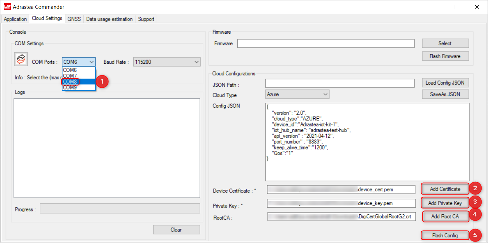


## Run the application

Now that the Adrastea-I FeatherWing kit is configured, press the reset button to start the application.


The application now reads all the sensor values, creates a JSON payload and publishes the same on to the pre-configured topic once every minute.


# View sensor data on Azure IoT explorer tool

Once the Adrastea module has been configured and flashed with Azure credentials, you can verify sensor data transmission using the Azure IoT Explorer.

✅ You should download the latest version of Azure IoT Explorer Preview from the link


## Get connection string from your Azure IoT hub

In order to connect to your IoT hub, you need the connection string which authenticates your IoT explorer tool. You will find this under "Security settings" -> "Share access policies" -> "iothubowner" -> "primary connection string". Copy this string


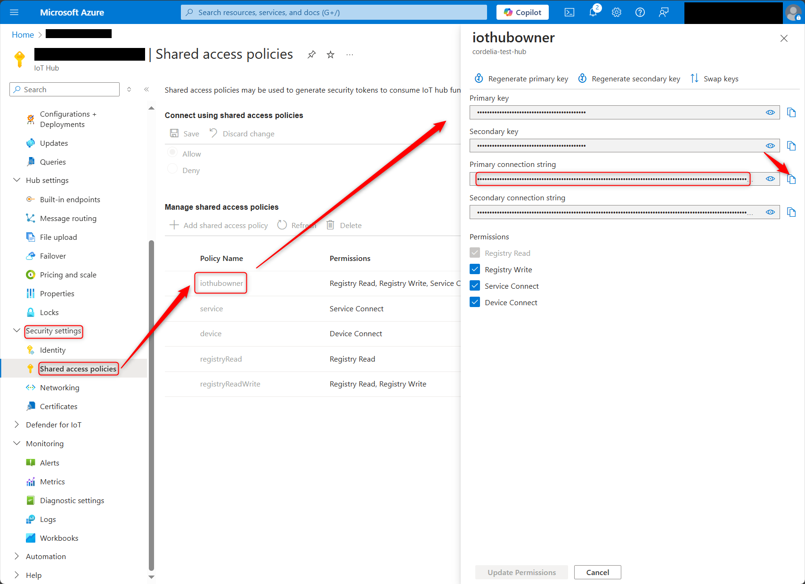

## Add your IoT Hub to Azure IoT Explorer

In your Azure explore, click on "Add connection" and paste the connection string copied in the previous step in to the "connection string" text box. The rest of the parameters will be set automatically. 

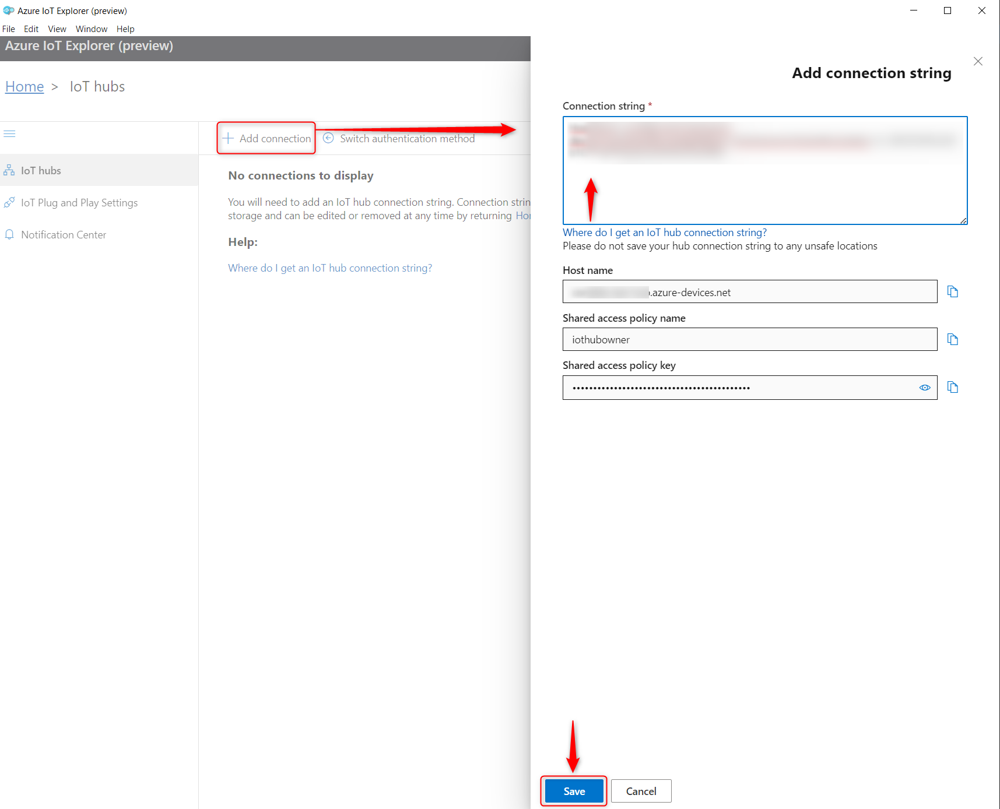


## Access IoT Hub
Go to  Azure IoT Explorer and click **View devices in this hub** (1)

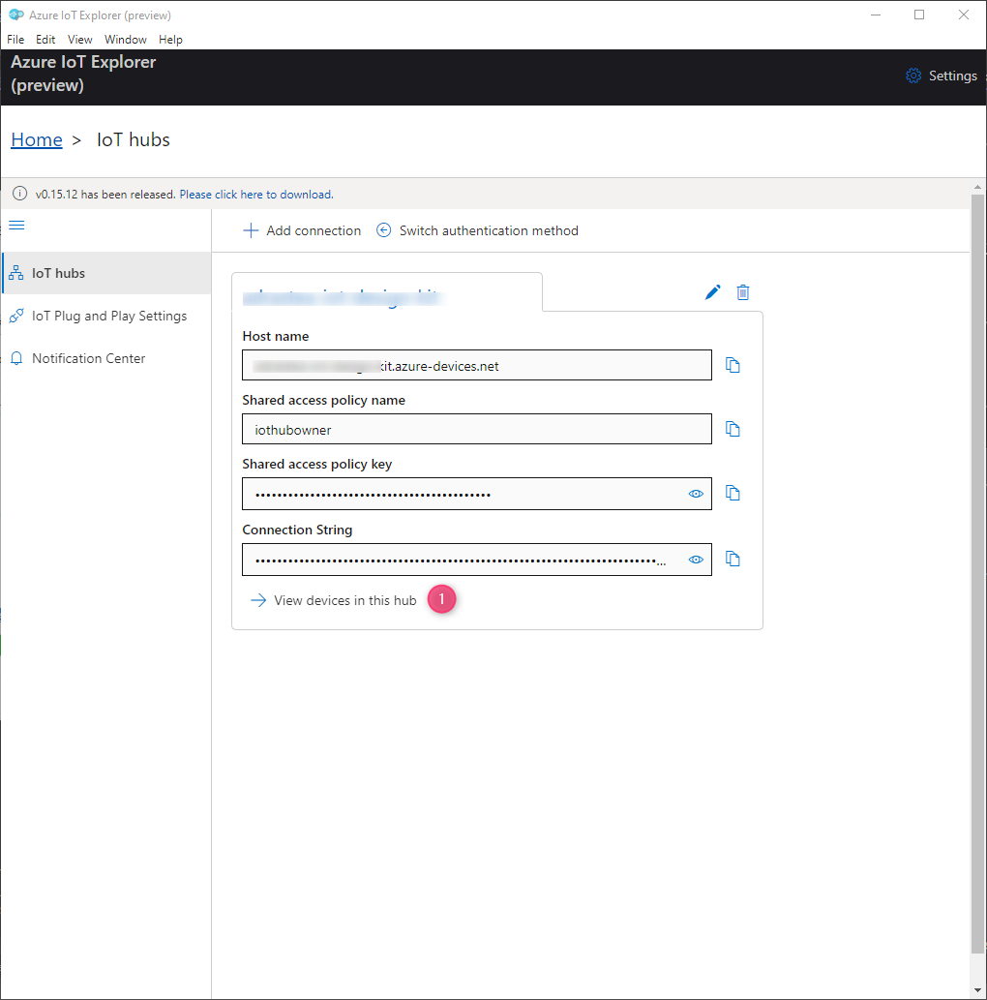

## Select Device from The List

Select your device from the list

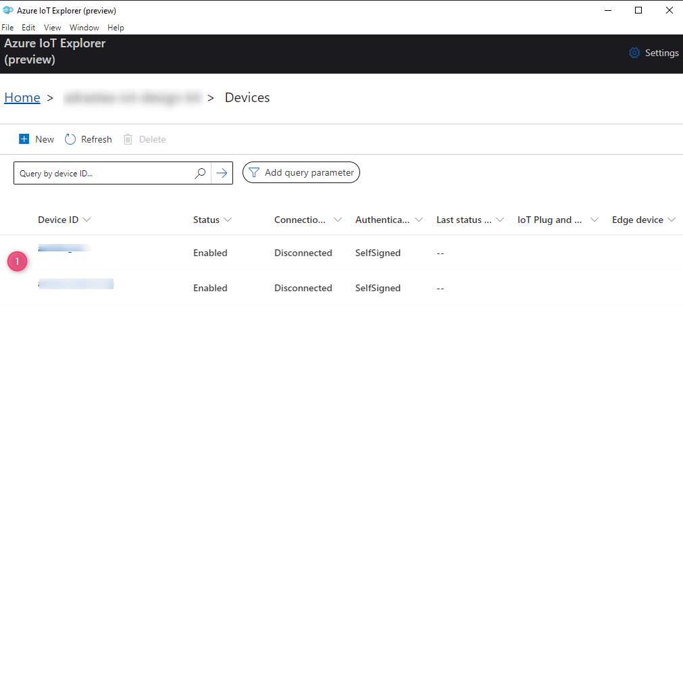

## View Telemetry

Go to **Telemetry** and and click start (1)


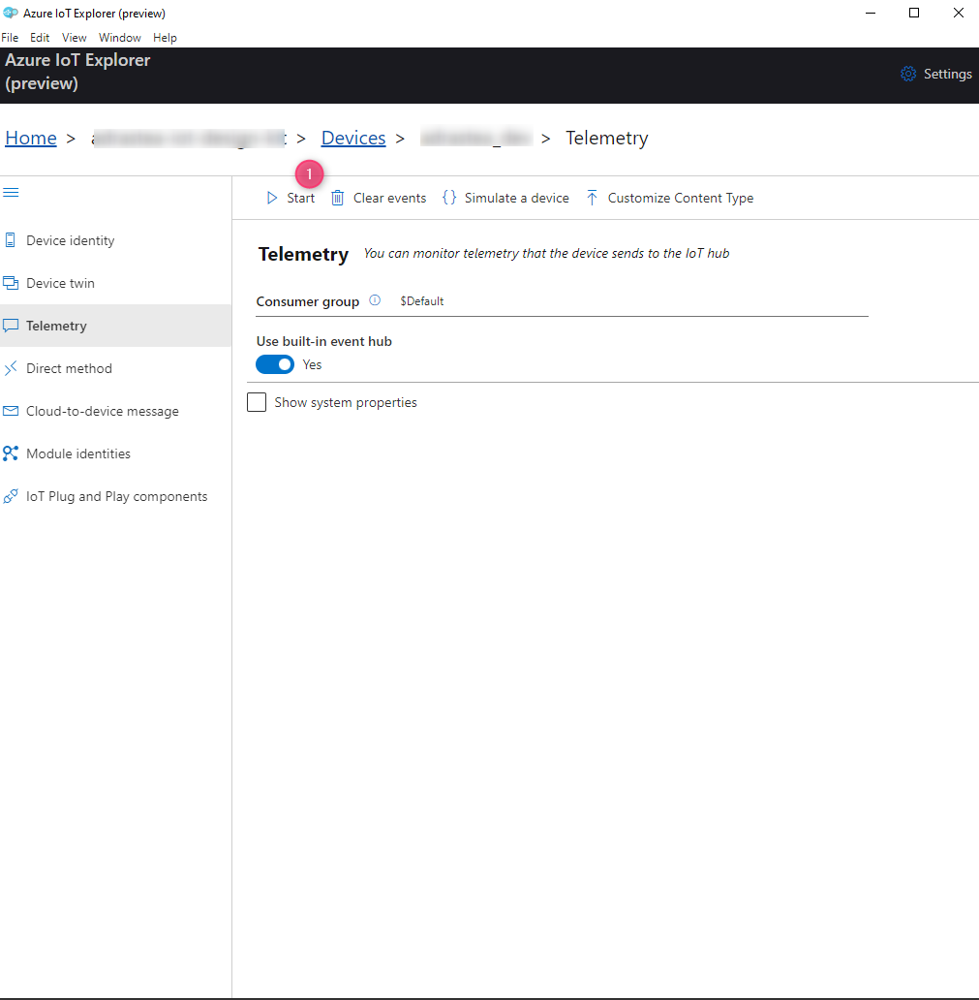


> ✅ You should see real-time messages appear in the Azure IoT Explorer.


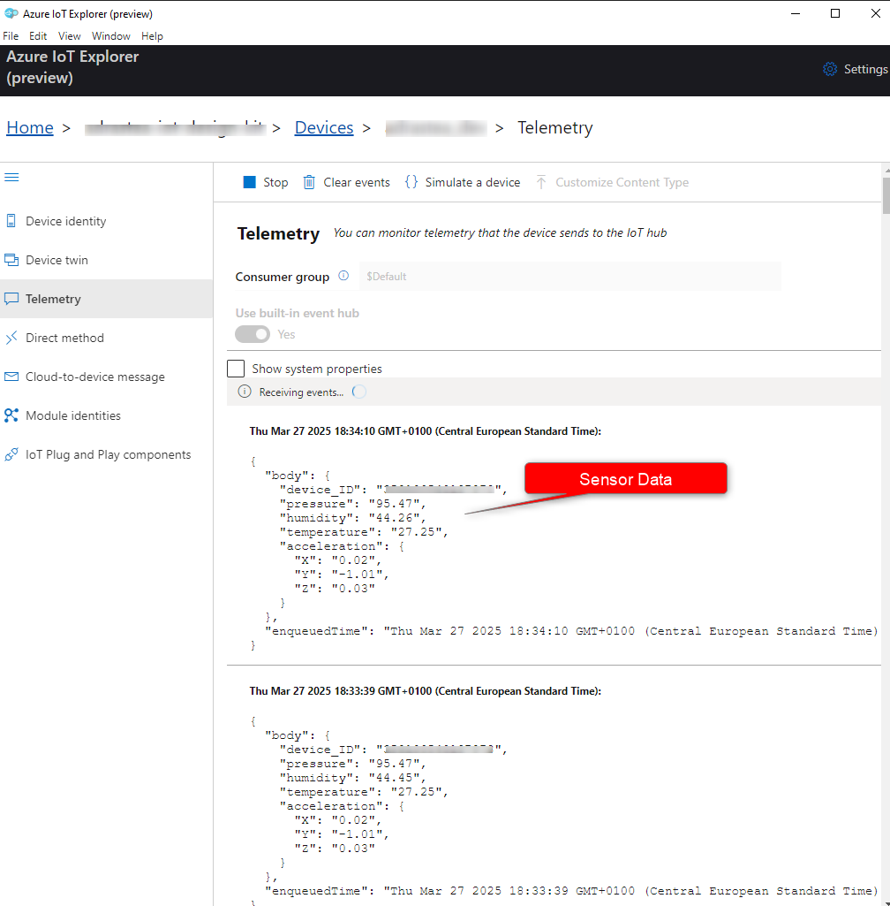