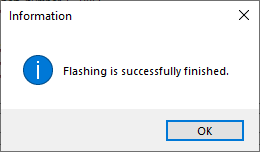

# Quick start guide using Kaa IoT

Kaa is an end-to-end IoT platform applicable for any scale of enterprise IoT projects. It provides a range of features that enable developers to build advanced applications for smart products, flexibly manage their connected devices via the cloud, orchestrate end-to-end data processing, analyze device telemetry, and many more. With the IoT features provided out of the box by Kaa, you can create your IoT applications up to 10 times faster than before.

This document will guide you through the process of configuring the Kaa IoT as well as the Adrastea-I FeatherWing kit and sending sensor data from the kit to Kaa.

# Kaa IoT Configuration Guide

This guide outlines the necessary steps to create and configure Kaa IoT Platform. Before proceeding, please familiarize yourself with the Kaa IoT platform by visiting the [official documentation page.](https://www.kaaiot.com/docs).

> [!WARNING] 
> Please ensure that you do not share your private keys and certificates with anyone.

## Setup Steps
To configure your Kaa IoT, follow these key steps:

1. **Create an Kaa IoT Account**  
2. **Create application and device**

## Step 1: Create an free trial account

Kaa IoT offers a free trial account that can be used for testing. Click [here](https://www.kaaiot.com/free-trial) and follow the instructions on the page to create your free account.

## Step 2: Create application and device

Once you login to your Kaa IoT account, click on "Add device" button in the home page.


In the pop-up, enter the following details:

- Application display name
- Application description
- Device name

And click on "Save". This will create a new device.


 In the pop-up, an endpoint toke will be generated. Please make sure to copy and save this token.


You can view the device created by click on "Device management" -> "<Your_device_name>"


In the device overview page copy the "appVersion.name" string.


# Configure Adrastea-I FeatherWing kit and run the application

In the previous step, we configured Kaa IoT platform. Here, we will configure the Adrastea-I FeatherWing kit to connect to the configured Kaa platform.

## Create and flash configuration file

The firmware on the Adrastea-I FeatherWing implements an MQTT client which can be configured by uploading a configuration file on to the flash memory.
The following steps will guide you through the process of creating and uploading the configuration file.

**Step 1:** In the "Cloud Settings" tab of the Adrastea Commander, click on the drop down "Cloud Type" in the "Cloud Configuration" section.
Select "KaaIoT" option. This will give you a configuration template in the "Config JSON" text box.


**Step 2:** Now modify the JSON configuration file by updating the following fields.

- Client ID - Name of the device you created in the previous step.
- End point token - Copied from the previous step.
- Application version - Copied from the previous step.

Here is an example,

```json
{
    "version":"3.0",
    "cloud_type":"KAAIOT",
    "client_id":"adrastea-iot-kit-1",
    "endpoint_url":"mqtt.cloud.kaaiot.com",
    "port_number" : "1883",
    "endpoint_token" : "QOUpTCWVzI",
    "application_version" : "cvqgb1lkhpfc73f5f0jg-v1",
    "keep_alive_time":"1200",
    "Qos":"1"
 }
```
You can optionally save this configuration file by clicking on the "SaveAs JSON" button. Use the "Load Config JSON" button to reload previously saved files.


**Step 3:** Now, let us flash the configuration file on to the Adrastea-I FeatherWing. In order to do this,

1. In the "Cloud Settings" tab of the Adrastea commander, select the last but one COM port (function: firmware update, COM2 as per example) from the "COM Ports" drop down.
2. Press the hardware reset button on the FeatherWing and the click on the "Flash Config".

Wait for the flashing process to complete. A progress bar shows the progress and status message will appear when the configuration file has been successfully flashed.

> [!WARNING] 
> Ensure that no other application is using or trying to access the COM port while flashing. Do not disconnect or reset the device during the flashing process from USB. Do not move the FeatherWing stack while this update is ongoing.





## Run the application

Now that the Adrastea-I FeatherWing kit is configured, press the reset button to start the application.


The application now reads all the sensor values, creates a JSON payload and publishes the same on to the pre-configured topic once every minute. You can view the telemetry data on the Kaa IoT platform.


# View sensor data on Kaa IoT

Open the device page by clicking click on "Device management" -> "<Your_device_name>"


You can view the telemetry data at the bottom of the device page.


