# Quick start guide using Eclipse Mosquitto broker
[Eclipse Mosquitto](https://mosquitto.org/) is an open source (EPL/EDL licensed) message broker that currently implements the MQTT protocol versions 5.0, 3.1.1 and 3.1. Mosquitto is lightweight and is suitable for use on all devices from low power single board computers to full servers.

[test.mosquitto.org](https://test.mosquitto.org/) is a publicly available Eclipse Mosquitto MQTT server/broker. [This server](https://test.mosquitto.org/) is provided as a service for the community to do testing, but it is also extremely useful for testing.

We will connect the Adrastea-I FeatherWing kit to this publicly available broker.

> [!WARNING]  
> **The MQTT server used here is public and data sent will be publicly accessible. Be aware of the data you share.**

It is possible to connect to the public Mosquitto broker using one of the following options:

1. [MQTT over TCP on port 1883](#connection-over-tcp-on-port-1883)
2. [MQTT over mTLS on port 8884](#connection-over-mtls-on-port-8884)


# Connection over TCP on port 1883
The connection to the Mosquitto broker over TCP on port 1883 is very simple and easy to test the MQTT protocol. However, this connection is not secure. There is no authentication between client and server and the data is not encrypted on transit.

> [!WARNING]  
> This method is intended for testing and should not be used in end application.

## Create and flash configuration file

The firmware on the Adrastea-I FeatherWing implements an MQTT client which can be configured by uploading a configuration file on to the flash memory.
The following steps will guide you through the process of creating and uploading the configuration file.

**Step 1:** In the "Cloud Settings" tab of the Adrastea Commander, click on the drop down "Cloud Type" in the "Cloud Configuration" section.
Select "Mosquitto" option. This will give you a configuration template in the "Config JSON" text box.

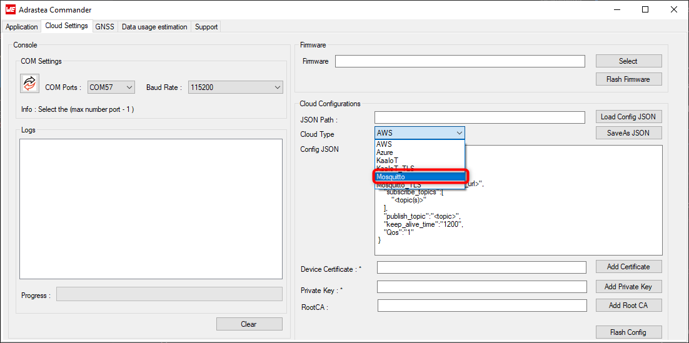


**Step 2:** Now modify the JSON configuration file by updating the following fields.

- Client ID - Unique identifier for onboard the MQTT client.
- Topics to subscribe
- Topic to publish

Here is an example,

```json
{
    "version": "5.0",
    "cloud_type":"MOSQUITTO",
    "client_id": "adrastea-iot-kit-1",
    "endpoint_url": "test.mosquitto.org",
    "port_number": "1883",
    "subscribe_topics": [
        "adrastea/+"
    ],
    "publish_topic": "adrastea/telemetry",
    "keep_alive_time": "1200",
    "Qos": "1"
}
```
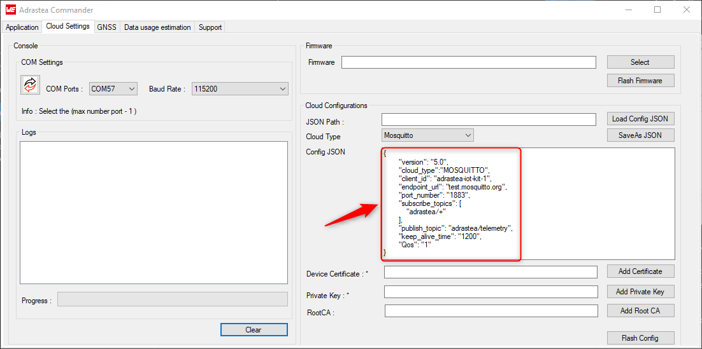

You can optionally save this configuration file by clicking on the "SaveAs JSON" button. Use the "Load Config JSON" button to reload previously saved files.


**Step 3:** Now, let us flash the configuration file on to the Adrastea-I FeatherWing. In order to do this,

1. In the "Cloud Settings" tab of the Adrastea commander, select the last but one COM port (function: firmware update, COM2 as per example) from the "COM Ports" drop down.
2. Press the hardware reset button on the FeatherWing and the click on the "Flash Config".

Wait for the flashing process to complete. A progress bar shows the progress and status message will appear when the configuration file has been successfully flashed.

> [!WARNING] 
> Ensure that no other application is using the same COM port while flashing. Do not disconnect or reset the device during the flashing process. Do not move the device while the update is ongoing.


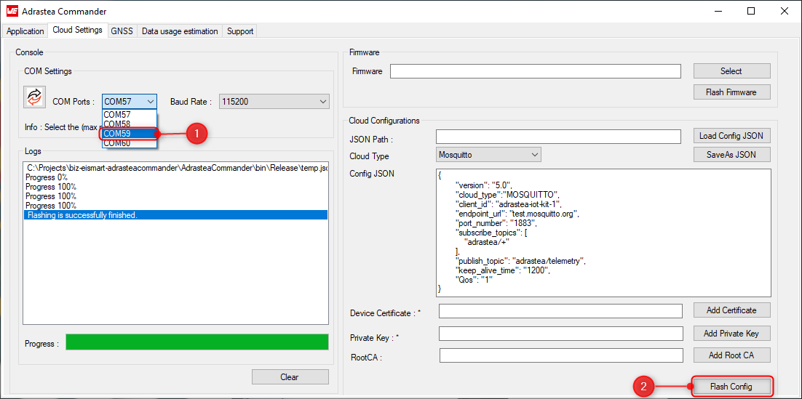


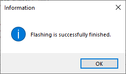

## Run the application

Now that the Adrastea-I FeatherWing kit is configured, press the reset button to start the application.


The application now reads all the sensor values, creates a JSON payload and publishes the same on to the pre-configured topic once every minute.

You can view the data sent by the Adrastea-I kit on [MQTT explorer](#view-the-data-on-mqtt-explorer). 


# Connection over mTLS on port 8884

The publicly available Mosquitto broker offers a secure MQTT interface over TLS on port 8884. This connection is built on top of mutual TLS where client and server mutually authenticate each other after which all the data exchanged is encrypted.

This connection requires each client to have unique private key and corresponding certificate signed by the Mosquitto broker. Additionally, the root CA certificate of the Mosquitto server needs to be save on the client side to enable server authentication.

## Create client private key and certificate

In order to perform client authentication, the client requires a unique key as well as the corresponding certificate signed by the Mosquitto server.

In this step we will create a key as well as client certificate for our Adrastea kit.

> [!WARNING] 
> We will use OpenSSL to create keys and perform other cryptographic operations. If you do not have OpenSSL installed on your PC you could use an online version of OpenSSL like [cryptotool.org](https://www.cryptool.org/en/cto/openssl/).


**Step 1:** Generate a private key using the following command. Note the location of the generated private key.

```
openssl genrsa -out client.key
```

**Step 2:** Generate a Certificate Signing Request (CSR) using the following command. When you are generating the CSR, please do not use the default values. At a minimum, the CSR must include the Country, Organization and Common Name fields.

```
openssl req -out client.csr -key client.key -new
```

**Step 3:** Open the following link in your browser.

[https://test.mosquitto.org/ssl/](https://test.mosquitto.org/ssl/)

Paste the CSR generated in the previous step in the designated text box. When you click on the "Submit" button, the CSR will be signed and the generated certificate will be automatically downloaded.

Make sure that you save both the client key and the certificate in a single location for future use.

## Download Root CA certificate
You can download the root CA certificate of the Mosquitto broker from this [link](https://test.mosquitto.org/ssl/mosquitto.org.crt).

Please store the root CA file in the same location as the client certificate and key for future use.

## Create configuration file

The firmware on the Adrastea-I FeatherWing implements an MQTT client which can be configured by uploading a configuration file on to the flash memory.
The following steps will guide you through the process of creating and uploading the configuration file.

**Step 1:** In the "Cloud Settings" tab of the Adrastea Commander, click on the drop down "Cloud Type" in the "Cloud Configuration" section.
Select "Mosquitto_TLS" option. This will give you a configuration template in the "Config JSON" text box.

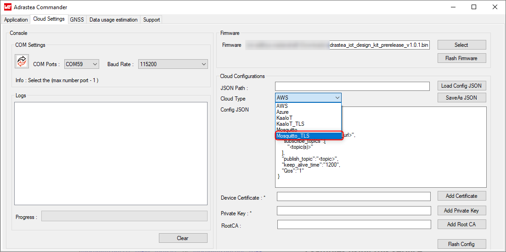


**Step 2:** Now modify the JSON configuration file by updating the following fields.

- Topics to subscribe
- Topic to publish

Here is an example,

```json
{
        "version": "6.0",
        "cloud_type":"MOSQUITTO_TLS",
        "endpoint_url": "test.mosquitto.org",
        "port_number": "8884",
        "subscribe_topics": [
            "adrastea/+"
        ],
        "publish_topic": "adrastea/telemetry",
        "keep_alive_time": "1200",
        "Qos": "1"
}
```
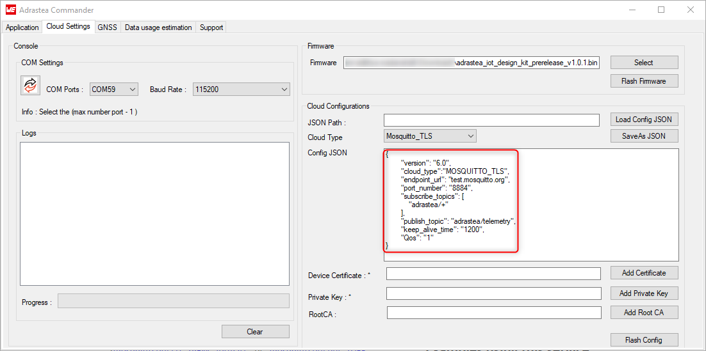

You can optionally save this configuration file by clicking on the "SaveAs JSON" button. Use the "Load Config JSON" button to reload previously saved files.

## Flash certificates, key and Configuration file
In the previous steps, we have created configuration JSON, client certificate, key and downloaded the root CA certificate. In this step we will flash these certificates on to the Adrastea-I FeatherWing.

In order to do this,

1. In the "Cloud Settings" tab of the Adrastea commander, select the last but one COM port from the "COM Ports" drop down.

2. Click of each of the following buttons to open the file explorer and each case select the corresponding file.

- "Add Certificate" -> client certificate
- "Add Private Key" -> client key
- "Add Root CA" -> root CA certificate

3. Press the hardware reset button on the FeatherWing and the click on the "Flash Config".

Wait for the flashing process to complete. A progress bar shows the progress and status message will appear when the configuration file has been successfully flashed.

> [!WARNING] 
> Ensure that no other application is using the same COM port while flashing. Do not disconnect or reset the device during the flashing process. Do not move the device while the update is ongoing.


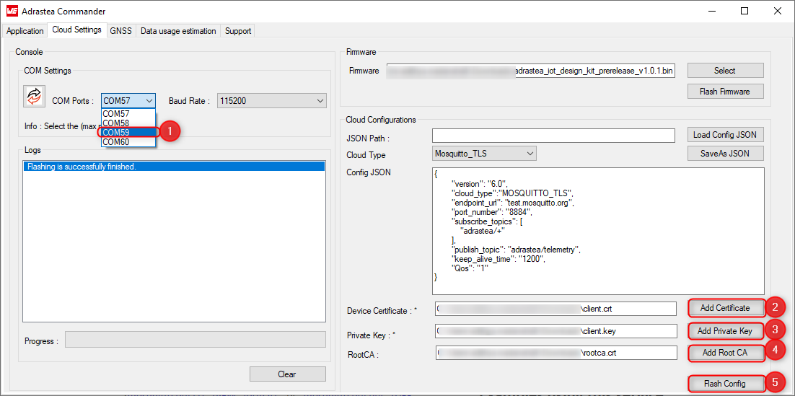


## Run the application

Now that the Adrastea-I FeatherWing kit is configured, press the reset button to start the application.


The application now reads all the sensor values, creates a JSON payload and publishes the same on to the pre-configured topic once every minute.

You can view the data sent by the Adrastea-I kit on [MQTT explorer](#view-the-data-on-mqtt-explorer).


# View the data on MQTT Explorer

MQTT explorer is a MQTT client available on multiple platforms. 
It is a comprehensive MQTT client that provides a structured overview of your MQTT topics and makes working with devices/services on your broker dead-simple.

[Download](https://mqtt-explorer.com/) and install the same.

Next, we will connect to the Mosquitto broker over TCP. In this case the connection is neither mutually authenticated nor encrypted.

## Connect MQTT Explorer to Mosquitto broker

Open the MQTT explorer tool. In the start-up page add the parameters of the MQTT broker/server.

1. Click on the "+ connections" button.
2. Give a unique name to this connection. For example, "mosquitto".
3. Enter the host name. This is the address of the MQTT broker/server "test.mosquitto.org"
4. Click on advance button.
In the advanced view,
5. Delete the default topic "#" in order to prevent receiving all messages published to this public server.
6. Delete the default topic "$SYS/#"
7. Type in a new topic name "adrastea/+". 
8. Click on add to subscribe to this topic by default on successful connection.
9. Click on "BACK" button to return to the default view.
10. Finally, click on the "CONNECT" button to connect to the broker.


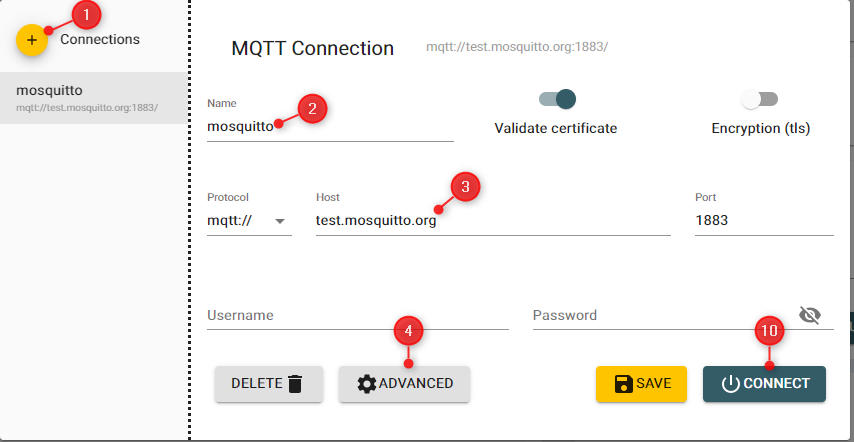

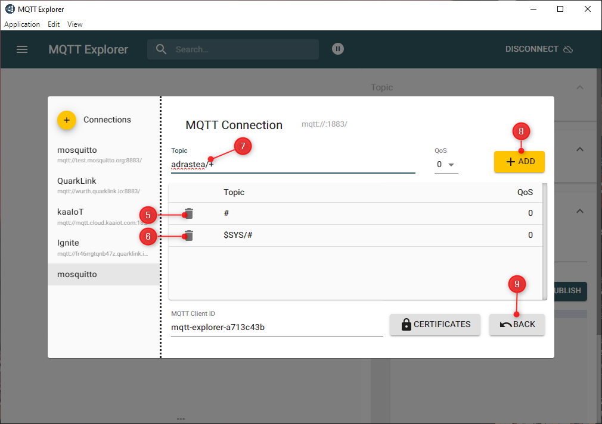


## Visualize data on the MQTT explorer

Once connected, you will see the data published by the kit in the data view.
Click on the topic and the subtopic to see the JSON payload in the "value section".
You can click on the "Add to chart" symbol to view the data graphically.

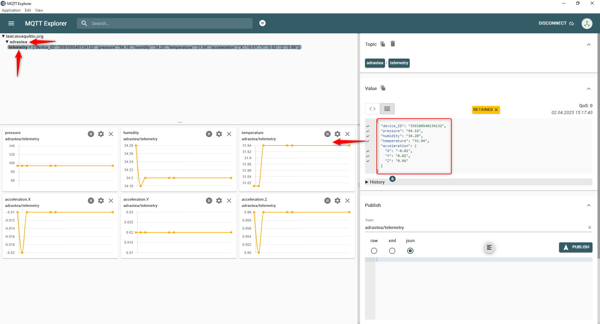

# View logs

In order to view logs output by the Adrastea-I FeatherWing, in the Adrastea Commander, open the "Application" tab. In the "COM settings" section, select the Console Logs COM port from the "Port" drop down (COM1 as per example) and click on "Connect". You will be able to see the logs in the log text box.


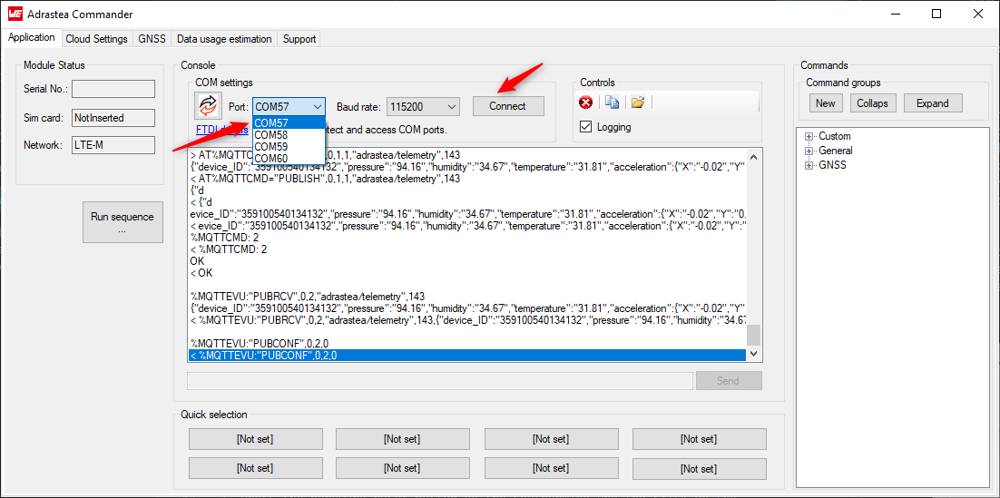